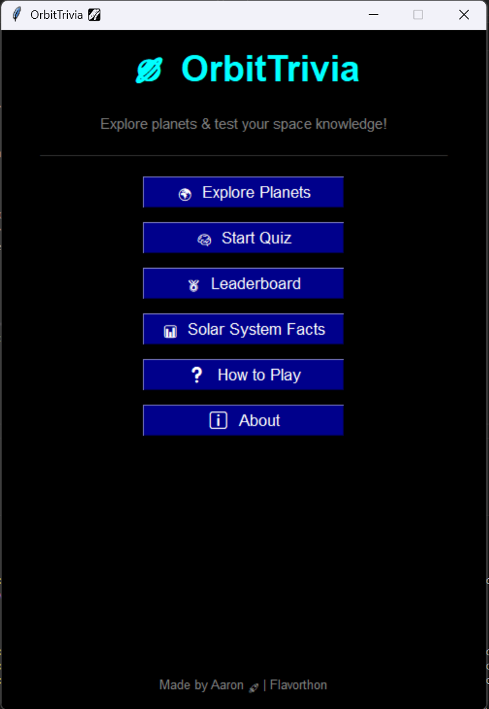
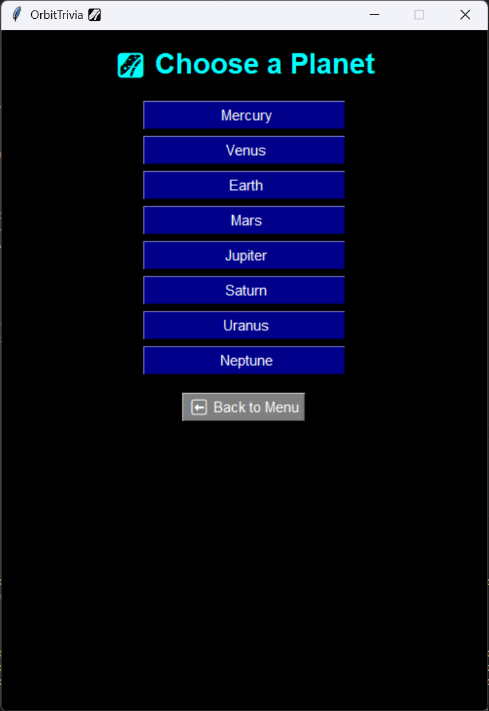
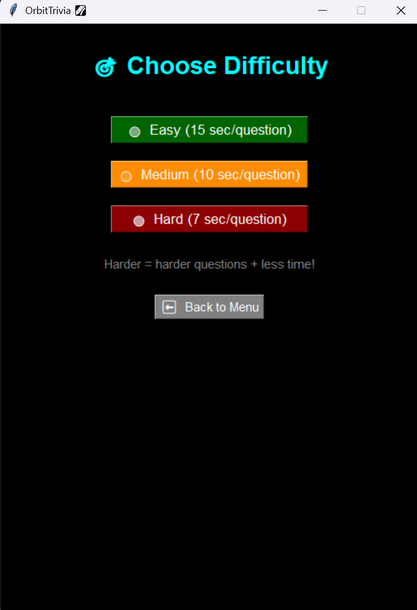
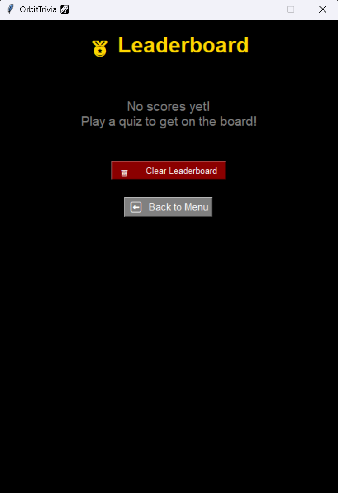
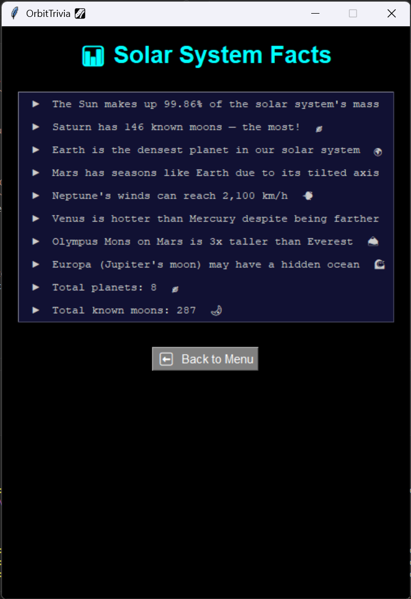
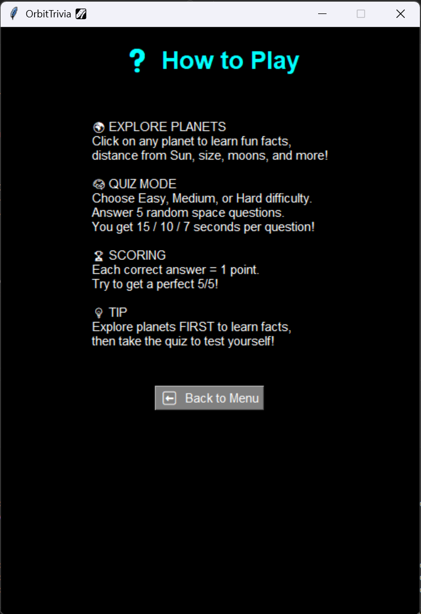
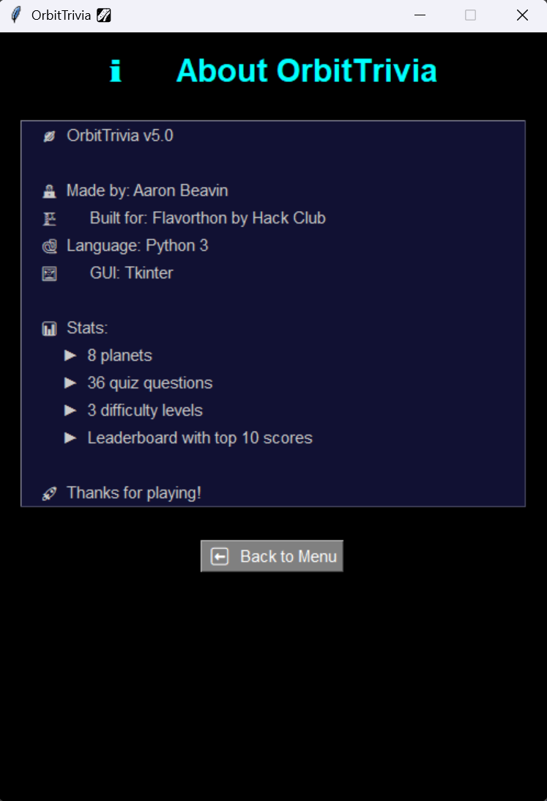

🪐 OrbitTrivia

**Explore the solar system & test your space knowledge!**

OrbitTrivia is a fun, interactive space-themed trivia app built with Python and Tkinter. Players can explore planets and take quizzes to test their knowledge about our solar system.

---
## 🎮 Play Online

👉 **[Play OrbitTrivia Here!](https://AaronBeavin.github.io/OrbitTrivia)**

> Note: This project was originally built in **Python with Tkinter**. 
> The web version is a playable demo of the same game.
> The original Python source code is in `orbit_trivia.py`.

---
## 🚀 Features

- 🌍 **Planet Explorer** — Click on any of the 8 planets to learn fun facts
- 🧠 **Quiz Mode** — Answer 5 random space questions per round
- ✅ **Instant Feedback** — Know if your answer is correct or wrong immediately
- 🏆 **Score Tracking** — See your score at the end of each quiz
- 🔄 **Replay** — Try again with new random questions each time
- 🌌 **Space-Themed UI** — Dark background with colorful buttons
- 🌟 **Hover Effects** — Buttons glow when you hover over them
- 🗑️ **Clear Leaderboard** — Reset scores with one click
- ℹ️ **About Screen** — Project info and stats
---

## 🖼️ Screenshots

---

## 🛠️ Built With

- **Python 3**
- **Tkinter** (built-in Python GUI library)
- **Random** module (for randomizing quiz questions)

**Total Development Time:** ~5 hours 24 minutes 
